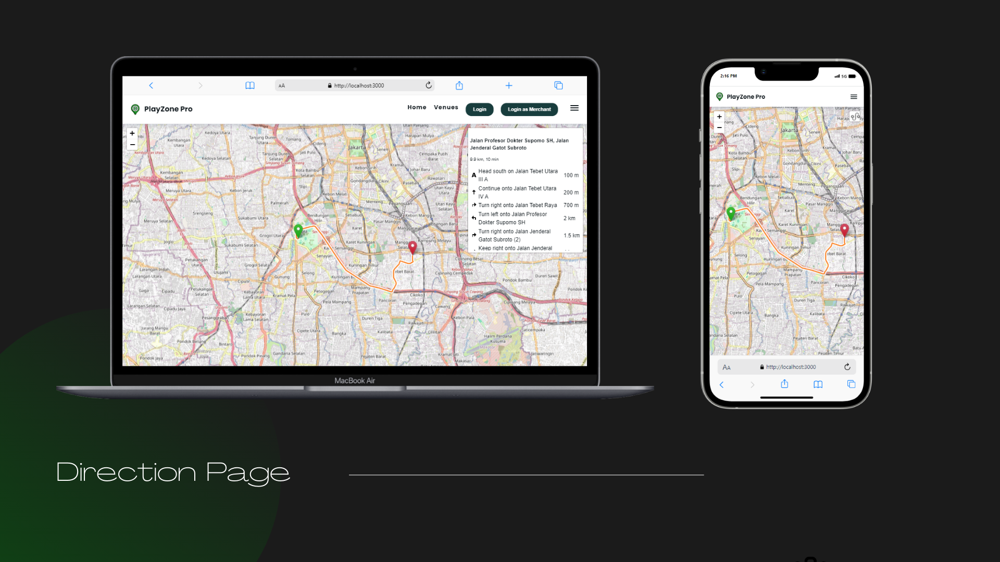

## PlayZone Pro

#### Easy, Fast, and Reliable

Web Site Aplication for booking venue Soccer, Badminton and Mini Soccer.

> **Note**
>
> This project is no longer being worked on. This branch repo only serves to give inspiration to others as a point in time reference.

## Stack

This project is no longer being worked on. This branch repo only serves to provide inspiration to others as a reference.:

- **Front-end** - React.js as the core library, Material UI for UI Framework, Redux with Redux-Saga for State Management, Sass for styling, React Hook Form, React-Leaflet for rendering map with open street map, moment js for render time, axios for faching data.
- **Back-end** - Express.js as the core framework, Joi validation, MYSQL as the core Database, Redis for chaching, Imgbb for cloud image, Midtrans for payment gateway, crypto.js for encryption payload

##

### Feature Highlights

##

### Feature Direction Route Merchant

##

### Venue Page

##

### Auth Merchant Page

##

### Back-end

Back-end program flow
:

### Front-end

Front-end program flow
:

